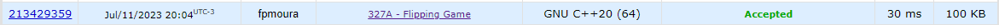

Questão do site [codeforces](https://codeforces.com/) no contest Codeforces Round 191 (Div. 2).

O problema consistia em achar qual a maior quantidade de números 1 que se poderia ter em um vetor binário, alternando valores em um intervalo específico apenas uma vez.

Para a resolução do exercício, foi utilizada força bruta junto a programação dinâmica, onde foi feita a contagem dos "1" em todos os possíveis intervalos de alternância, e depois identificando o máximo dessa contagem. 

