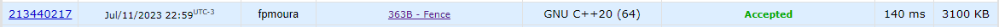

Questão do site [codeforces](https://codeforces.com/) no contest Codeforces Round 211 (Div. 2).

O problema consistia em achar a subsequência de k números de um vetor cuja soma fosse a menor possível.

Para a resolução do exercício, foi calculada a soma de todas as subsequências possíveis, para depois, de todos os resultados, encontrar o menor, utilizando programação dinâmica.

