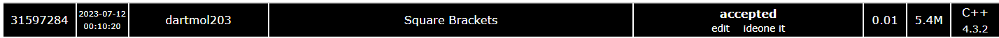

Questão do site [SPOJ](https://www.spoj.com/problems/SQRBR/) de nome SQRBR.

O problema consistia identiticar a maior quantidade de sequencias validas de colchetes com as condições determinadas em cada caso de teste.

Foi utilizado uma abordagem em programação dinamica, em que se apoiava fortemente em recursão e memoização.

